## 计算机毕业设计hadoop+spark知识图谱医生推荐系统 门诊人数预测 医疗数据可视化 医疗大数据 医疗数据分析 医生爬虫 大数据毕业设计 大数据毕设 neo4j知识图谱 深度学习 机器学习 酒店数据分析 人工智能 神经网络

## 要求
### 源码有偿！一套(论文 PPT 源码+sql脚本+教程)

简易

https://www.bilibili.com/video/BV1ah4y1M7Jx/?spm_id_from=333.999.0.0

详细

https://www.bilibili.com/video/BV11N411D7Yd/?spm_id_from=333.999.0.0

### 
### 加好友前帮忙start一下，并备注github有偿医生推荐
### 我的QQ号是2827724252或者798059319或者 1679232425或者微信:bysj2023nb

# 

### 加qq好友说明（被部分 网友整得心力交瘁）：
    1.加好友务必按照格式备注
    2.避免浪费各自的时间！
    3.当“客服”不容易，repo 主是体面人，不爆粗，性格好，文明人。

# 开发技术
springboot
vue.js
element-ui
spark
hadoop
lstm情感分析模型
KNN/CNN卷积神经/线性回归
协同过滤算法(用户+物品)
MLP神经网络
SVD深度学习模型
echarts
python爬虫
mysql
neo4j

# 特色/创新点
修改密码短信接收验证码
4种深度学习/机器学习推荐算法
深度学习预测算法
百度AI识别
支付宝沙箱支付
数据可视化大屏
知识图谱推荐/可视化
支付宝沙箱支付
医生评论情感分析
30+种创新点

# 运行截图

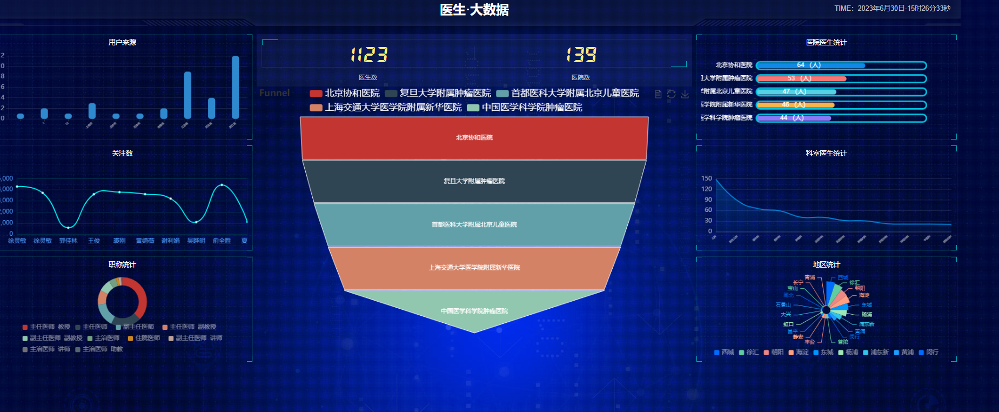
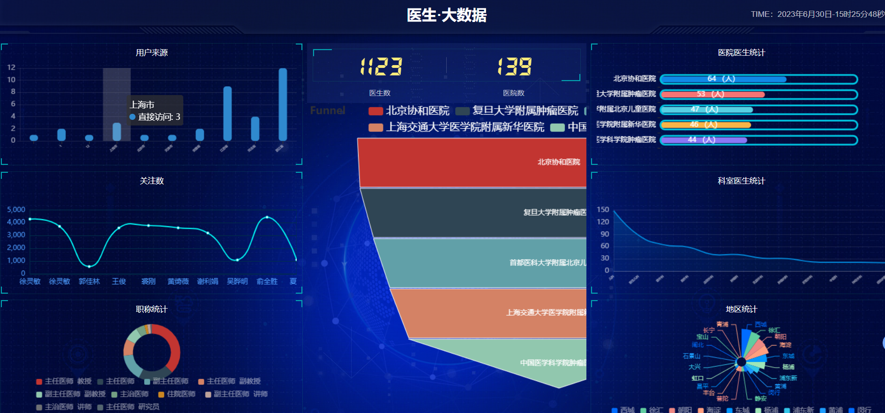

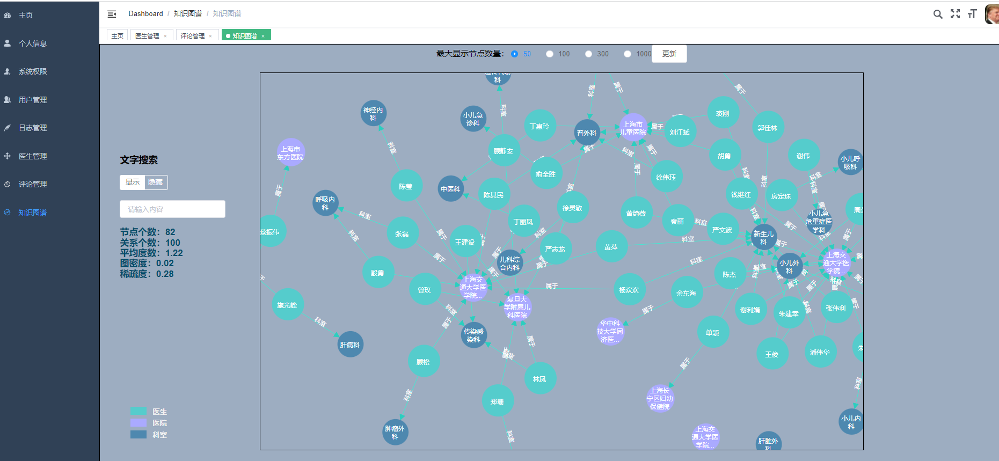
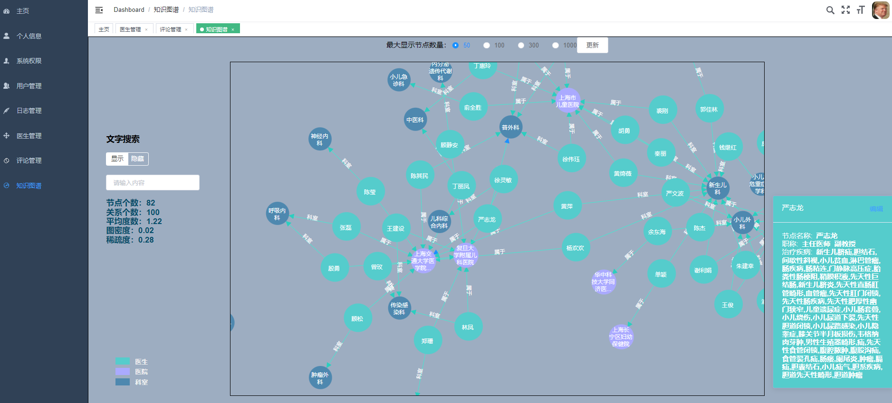
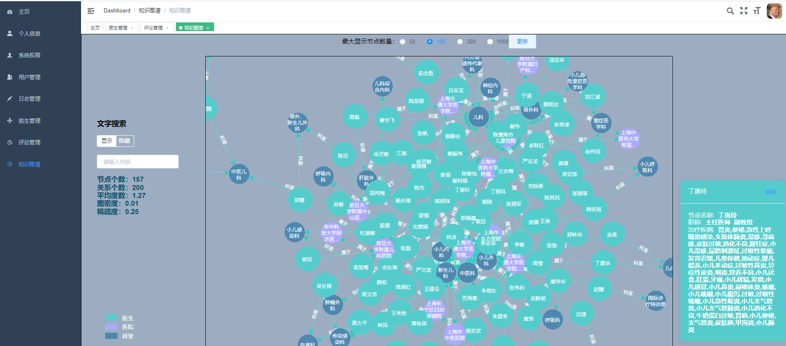
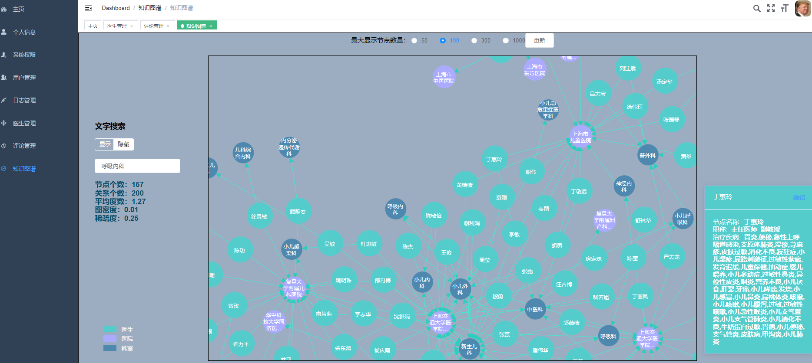

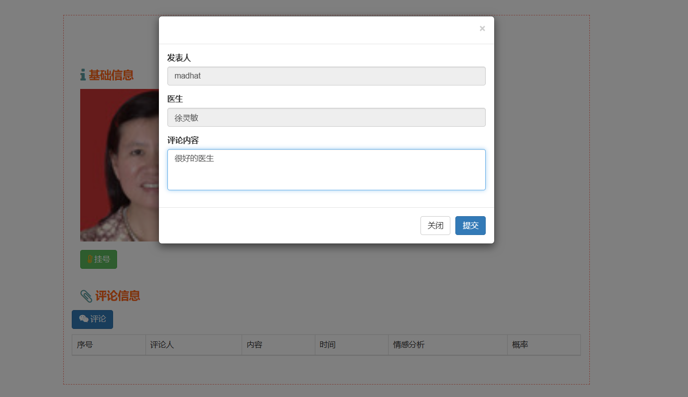

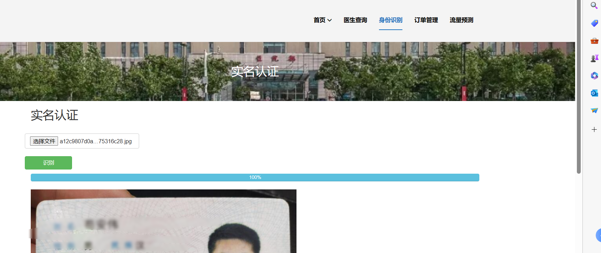

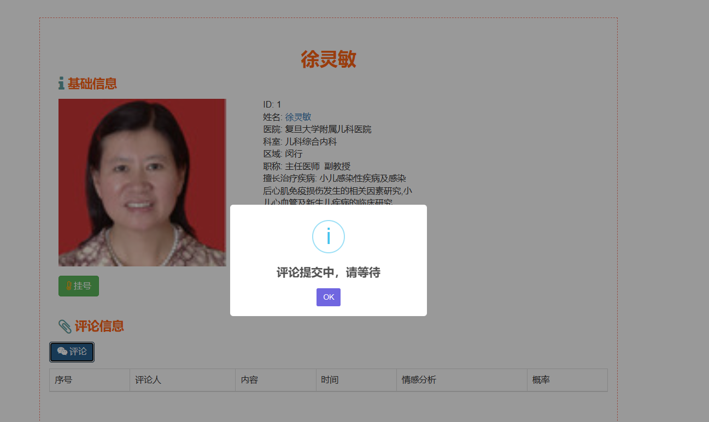

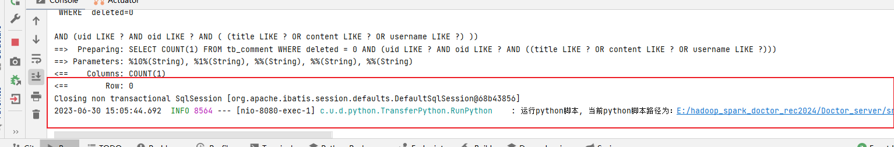

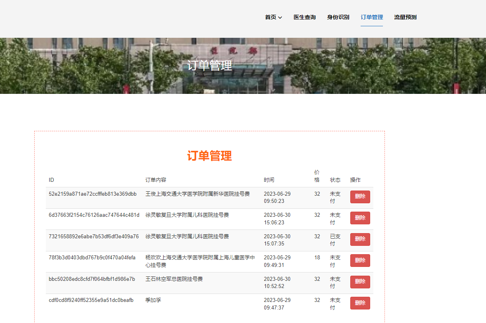

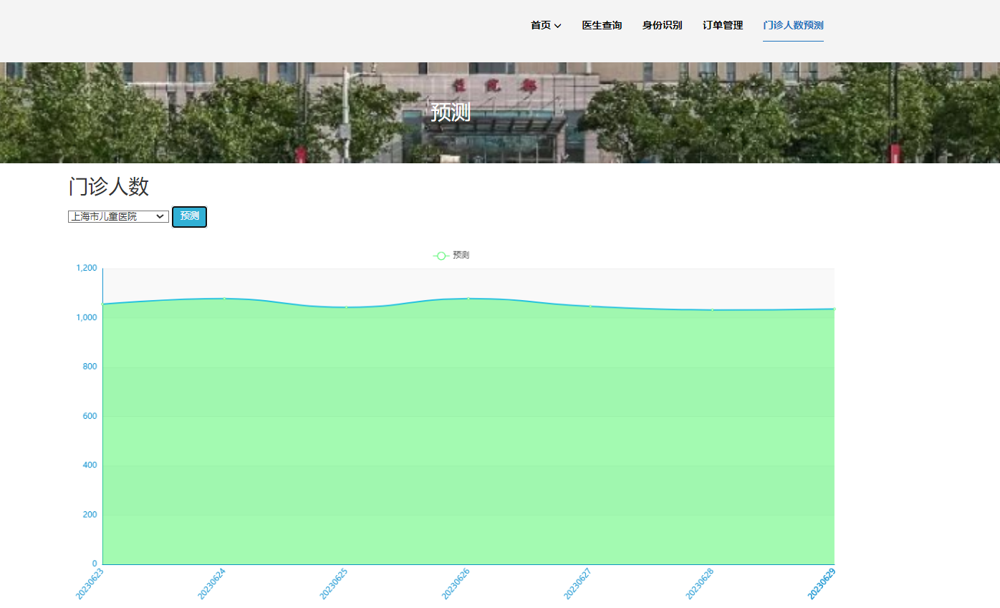

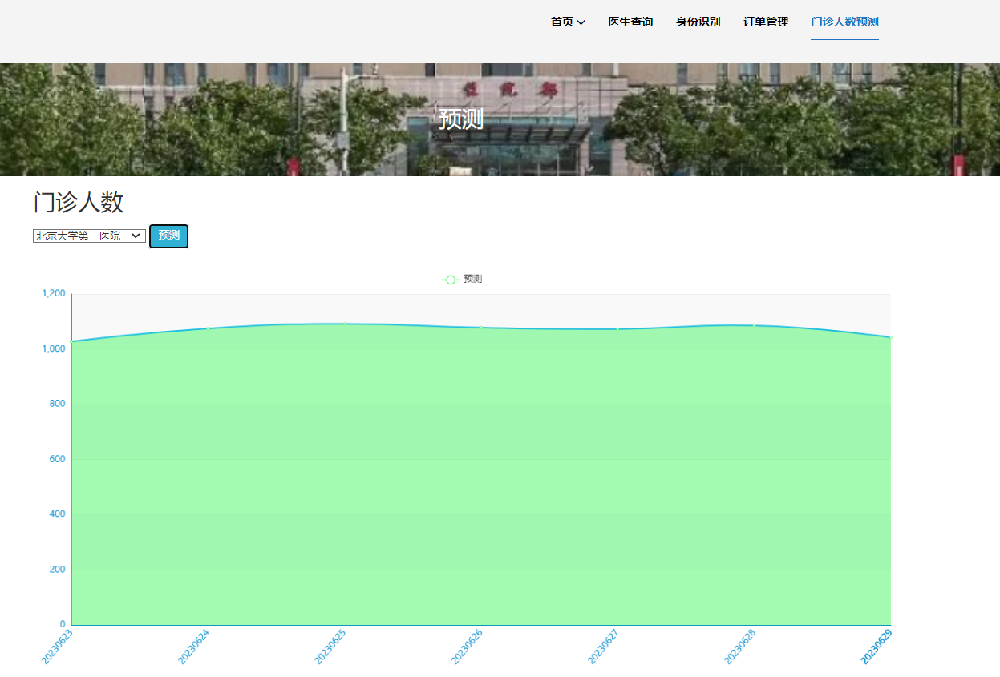

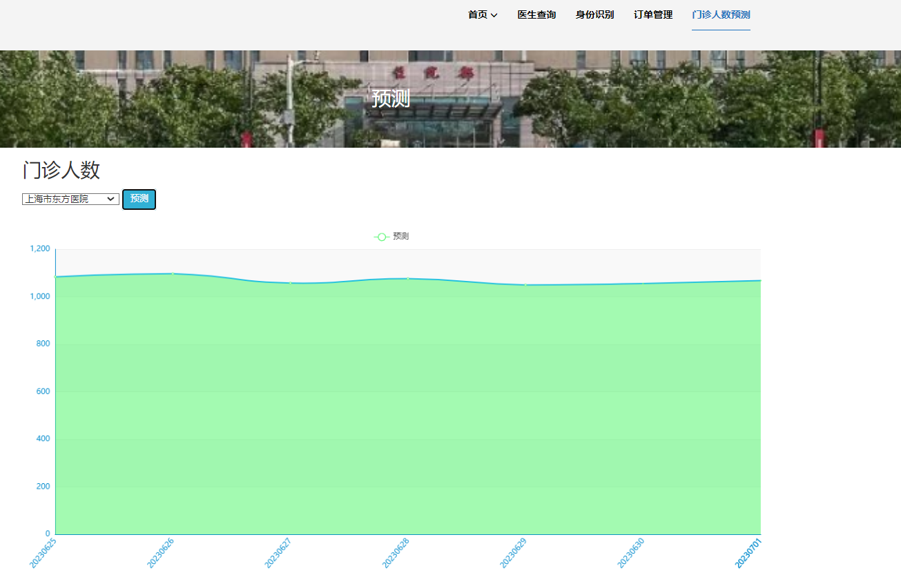

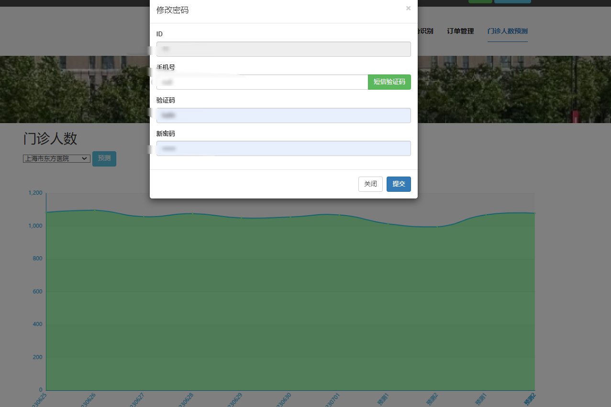

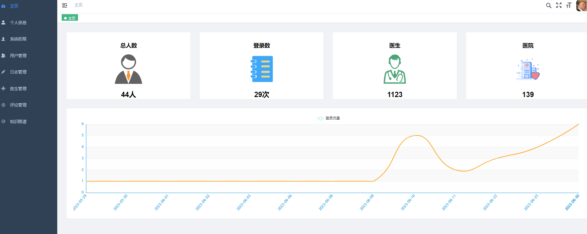

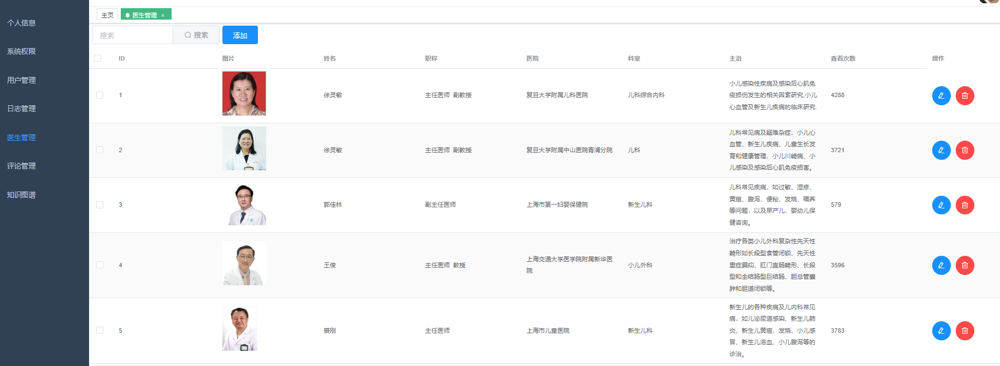

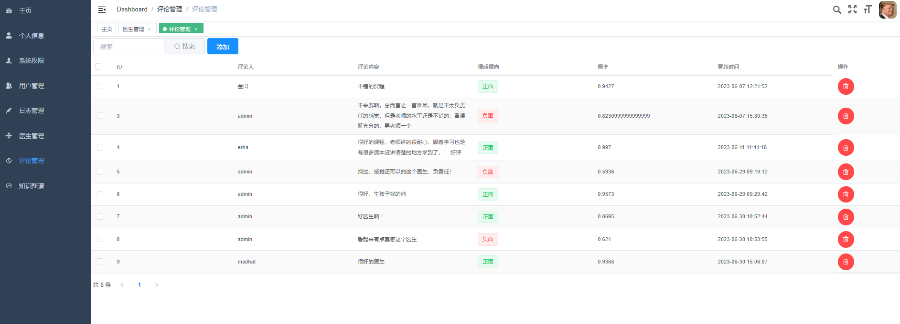

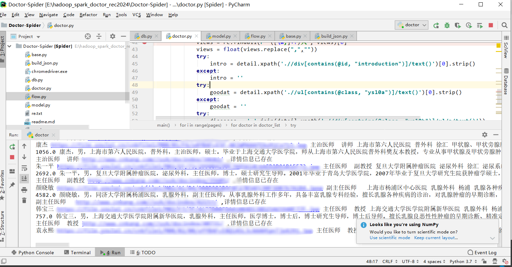

# B站演示视频

简易

https://www.bilibili.com/video/BV1ah4y1M7Jx/?spm_id_from=333.999.0.0

详细

https://www.bilibili.com/video/BV11N411D7Yd/?spm_id_from=333.999.0.0

